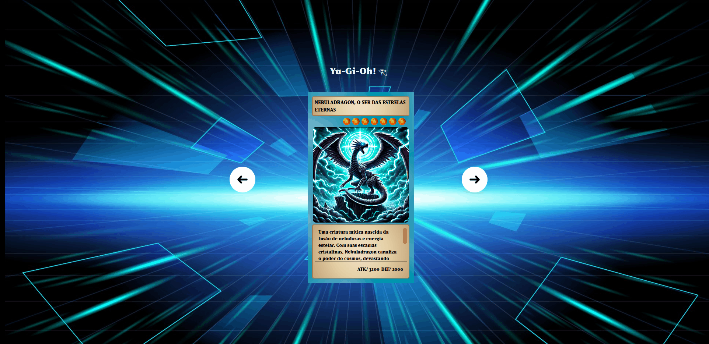

# Projeto Yu-Gi-Oh! 𓂀

### O projeto é baseado em criar cartas do Desenho/Anime "Yu-Gi-Oh!", onde as cartas ficam ocultas em posição de defesa (deitadas) ou em modo de ataque (em pé), além de serem responsivas.

## Tecnologias utilizadas

- HTML 🧌
- CSS 🐉
- JS 🧙‍♂️
